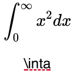

# react-katex

[](https://travis-ci.org/talyssonoc/react-katex) [](https://codeclimate.com/github/talyssonoc/react-katex)

Display math with KaTeX and ReactJS!

## Installing

You can install it with npm:

```sh
  $ npm install --save react-katex
```

With Yarn:

```sh
  $ yarn add react-katex
```

Or use one of the files inside the `dist` folder.

__When using react-katex directly from the browser, react-katex will export a global called ReactKaTeX. Notice that the T and X from "KaTeX" are uppercased.__

__Don't forget to import KaTeX CSS file (see `example/index.html`)__.

__If you open the example file on Firefox directly (i.e. without a server) the fonts won't load, open it on Chrome or put it on some server. You can use some [static one-liner](https://gist.github.com/willurd/5720255).__

## Usage

`react-katex` has two types of math components, `InlineMath` and `BlockMath`.

### InlineMath

Display math in the middle of the text.

```jsx
  var InlineMath = ReactKaTeX.InlineMath;

  ReactDOM.render(<InlineMath math="\\int_0^\\infty x^2 dx"/>,
                document.getElementById('math'));

  // or

  ReactDOM.render(<InlineMath>\int_0^\infty x^2 dx</InlineMath>,
                document.getElementById('math'));
```

It will be rendered like this:


### BlockMath

Display math in a separated block, with larger font and symbols.

```jsx
  var BlockMath = ReactKaTeX.BlockMath;

  ReactDOM.render(<BlockMath math="\\int_0^\\infty x^2 dx"/>,
                document.getElementById('math'));

  // or

  ReactDOM.render(<BlockMath>\int_0^\infty x^2 dx</BlockMath>,
                document.getElementById('math'));
```

It will be rendered like this:


### Error handling

#### The KaTeX way

KaTeX's [error rendering options](https://github.com/Khan/KaTeX/blob/29fc2d56d409aaf5875601dc57da2cf66d1577e2/README.md#rendering-options) can be used and you can pass `errorColor` (defaults to `#cc0000`) as a prop:

```jsx
var BlockMath = ReactKaTeX.BlockMath;

ReactDOM.render(
  <BlockMath
    math={'\\int_0^\\infty x^2 dx \\inta'}
    errorColor={'#cc0000'}
  />, document.getElementById('math'));
```

This will be rendered like so:



#### Modified

It's possible to handle parse errors using the prop `renderError`. This prop must be a function that receives the error object and returns what should be rendered when parsing fails:

```jsx
var BlockMath = ReactKaTeX.BlockMath;

ReactDOM.render(
  <BlockMath
    math="\\int_{"
    renderError={(error) => {
      return <b>Fail: {error.name}</b>
    }}
  />,
  document.getElementById('math'));

// The code above will render '<b>Fail: ParseError</b>' because it's the value returned from `renderError`.
```

This will render `<b>Fail: ParseError</b>`:


